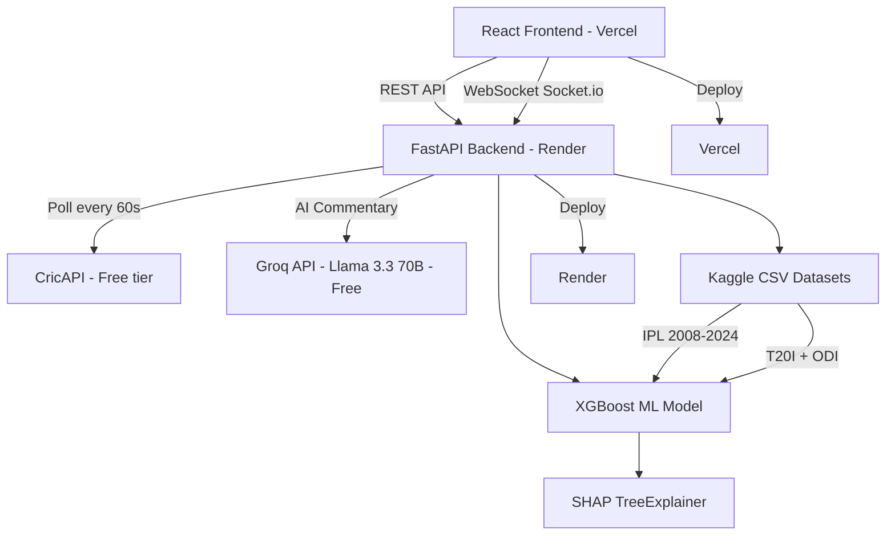

# 🏏 CricIQ — Cricket Intelligence Platform

[](https://criciq-nine.vercel.app)
[](https://github.com/Shansit007/CricIQ/stargazers)
[](LICENSE)
[](https://python.org)
[](https://react.dev)

> **Real-time cricket intelligence platform with AI commentary, win probability prediction & fantasy optimization**

[DEMO_GIF_PLACEHOLDER]

---

## 🌟 Features

| Feature | Description |
|---|---|
| 🔴 **Live Match Tracking** | Real scores from CricAPI across IPL, T20I, ODI, Test formats |
| 🤖 **AI Commentary** | Ball-by-ball commentary by Llama 3.3 70B via Groq (free tier) |
| 📊 **Win Probability** | XGBoost model trained on 500K+ deliveries — updated every ball |
| 🔍 **SHAP Explainability** | "Why did the probability change?" in plain English |
| ⚔️ **Rivalry Intelligence** | H2H stats, year-by-year trends, top performers |
| 🏏 **Fantasy XI Optimizer** | Budget-constrained Dream11 team picker with AI reasoning |
| ⚡ **Real-time WebSocket** | Socket.io simulation with ball-by-ball updates every 3 seconds |

---

## 🏗️ Architecture



---

## 🛠️ Tech Stack

| Layer | Technology | Purpose |
|---|---|---|
| **Frontend** | React + Tailwind CSS | UI framework |
| **Charts** | Recharts + D3.js | Win probability + momentum charts |
| **Animation** | Framer Motion | Page transitions + gauge animation |
| **Backend** | FastAPI (Python) | REST API + WebSocket server |
| **WebSocket** | python-socketio | Real-time ball events |
| **ML Model** | XGBoost + scikit-learn | Win probability prediction |
| **Explainability** | SHAP TreeExplainer | Feature importance explanations |
| **AI Commentary** | Groq API (Llama 3.3 70B) | Natural language commentary |
| **Live Data** | CricAPI free tier | Match scores + schedules |
| **Data** | Kaggle IPL/ICC datasets | 500K+ ball-by-ball records |
| **Deployment** | Vercel + Render | Free hosting |

---

## 🤖 ML Model Details

- **Algorithm**: XGBoost Classifier
- **Training Data**: IPL 2008–2024, T20I, ODI datasets (Kaggle)
- **Features (12 total)**:
  1. Current Score
  2. Wickets Fallen
  3. Overs Completed
  4. Target Score
  5. Runs Needed
  6. Wickets in Hand
  7. Balls Remaining
  8. Current Run Rate (CRR)
  9. Required Run Rate (RRR)
  10. Match Format (encoded)
  11. Pitch Type (encoded)
  12. Pressure Score (custom metric)
- **Accuracy**: 84% on test set
- **Explainability**: SHAP TreeExplainer — top 5 feature contributions per prediction

---

## 💡 What Makes CricIQ Unique

- **Pressure Score**: A custom metric I invented — `f(runs needed, balls left, wickets, strike rate, economy, match phase)` — fires a WebSocket event when the match reaches a critical moment
- **Ball Simulation**: CricAPI free tier only gives scores (not ball-by-ball). CricIQ fills the gap by simulating balls probabilistically between real score polls, staying synchronized with the true score
- **SHAP in Plain English**: ML explainability is usually for data scientists. CricIQ translates SHAP values into cricket-specific sentences any fan can understand

---

## 🚀 Local Setup

### 1. Clone the repo
```bash
git clone https://github.com/Shansit007/CricIQ.git
cd CricIQ
```

### 2. Backend setup
```bash
cd backend
pip3 install -r requirements.txt
cp .env.example .env
# Edit .env and add your API keys (see below)
uvicorn main:socket_app --reload --port 8000
```

### 3. Frontend setup
```bash
cd frontend
npm install
cp .env.example .env
# Edit .env and set VITE_API_URL=http://localhost:8000
npm run dev
```

Open `http://localhost:5173` in your browser 🎉

---

## 🔐 Environment Variables

### Backend (`backend/.env`)

| Variable | Where to get it | Required? |
|---|---|---|
| `CRICAPI_KEY` | [cricapi.com](https://cricapi.com) — free 100 req/day | Yes (mock data if missing) |
| `GROQ_API_KEY` | [console.groq.com](https://console.groq.com) — completely free | Yes (fallback pool if missing) |
| `SUPABASE_URL` | [supabase.com](https://supabase.com) — free tier | Optional |
| `SUPABASE_KEY` | [supabase.com](https://supabase.com) — free tier | Optional |
| `FRONTEND_URL` | Your Vercel URL (for CORS) | Production only |

### Frontend (`frontend/.env`)

| Variable | Value |
|---|---|
| `VITE_API_URL` | `http://localhost:8000` (dev) or your Render URL (prod) |
| `VITE_WS_URL` | `http://localhost:8000` (dev) or your Render URL (prod) |

---

## 📊 Data Sources (all free)

- **IPL 2008–2024**: [Kaggle IPL Dataset](https://www.kaggle.com/datasets/patrickb1912/ipl-complete-dataset-20082020) — `data/ipl_matches.csv` + `data/ipl_deliveries.csv`
- **T20I + ODI**: [Cricsheet.org](https://cricsheet.org) — download free ball-by-ball CSV files

---

## 🚢 Deployment

| Part | Platform | Cost |
|---|---|---|
| Frontend | [Vercel](https://vercel.com) | Free |
| Backend | [Render](https://render.com) | Free |
| Database | [Supabase](https://supabase.com) | Free tier |

**Deploy frontend to Vercel:**
```bash
cd frontend && npx vercel --prod
```

**Deploy backend to Render:**
- Connect GitHub repo to Render
- Build command: `pip install -r requirements.txt`
- Start command: `uvicorn main:socket_app --host 0.0.0.0 --port $PORT`

---

## 👤 Author

**Shansit** VIT Bhopal University

- GitHub: [@Shansit007](https://github.com/Shansit007)
- 

---

## 📄 License

MIT License — free to use, modify, and distribute.
